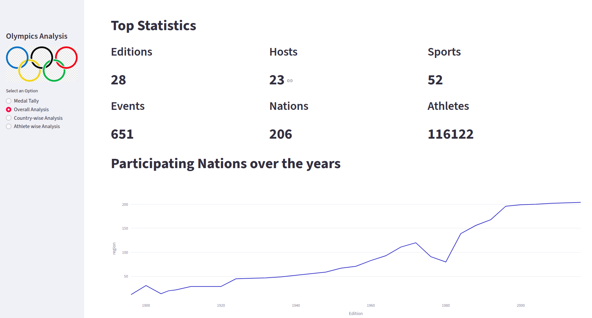
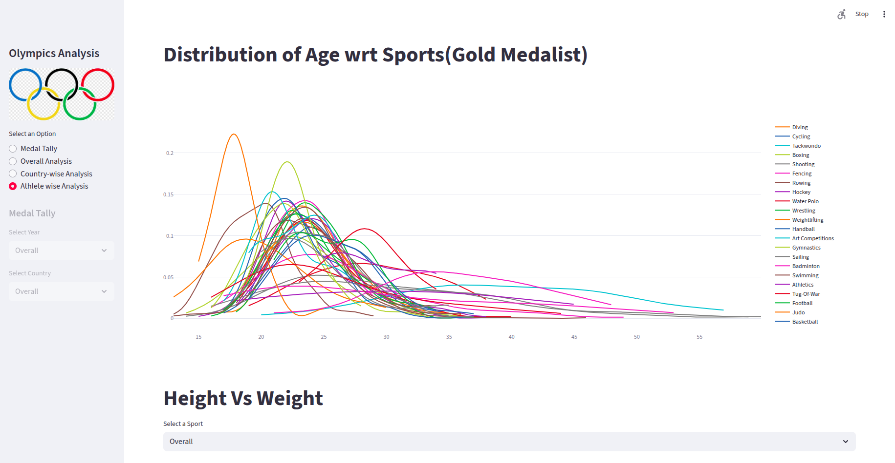

# 🏅 Olympic Data Analysis Web App




## 📖 About
This project is a comprehensive web application designed to analyze and visualize **120 years of Olympic history**. Built with **Streamlit** and **Python**, it offers deep insights into athlete performances, country-wise achievements, and the evolution of the Games over time.

## ✨ Key Features

### 1. Medal Tally
*   **Interactive Tables**: View medal tallies filtered by specific years and countries.
*   **Global Overview**: See overall performance rankings across all Olympic editions.

### 2. Overall Analysis
*   **Top Statistics**: Quick summary of total editions, host cities, sports, events, nations, and athletes.
*   **Trends Over Time**: Visualizations showing the growth of participating nations, events, and athletes over the years.
*   **Heatmaps**: "No. of Events over time" heatmap to track the popularity and inclusion of sports.
*   **Most Successful Athletes**: Identify the top 15 most successful athletes across all sports or specific disciplines.

### 3. Country-wise Analysis
*   **Medal Trends**: Line charts tracking a specific country's medal count over the years.
*   **Excelling Sports**: Heatmap visualizing which sports a country performs best in.
*   **Top Athletes**: List of the top 10 most successful athletes for the selected nation.

### 4. Athlete-wise Analysis
*   **Age Distribution**: Probability density plots showing the age distribution of all athletes vs. medal winners (Gold, Silver, Bronze).
*   **Sport-Specific Age Trends**: Analyze age distribution for Gold Medalists in specific sports.
*   **Physical Attributes**: Scatter plots exploring the relationship between **Height vs. Weight** for athletes, categorized by medal status and gender.
*   **Gender Participation**: Comparative analysis of Men vs. Women participation over the history of the Olympics.

## 🛠️ Technologies Used
*   **[Streamlit](https://streamlit.io/)**: For creating the interactive web application.
*   **[Pandas](https://pandas.pydata.org/)**: For robust data manipulation and analysis.
*   **[Plotly](https://plotly.com/)** & **[Seaborn](https://seaborn.pydata.org/)** & **[Matplotlib](https://matplotlib.org/)**: For generating interactive and static visualizations.

## 📂 Data Source
The dataset used in this project is based on **"120 years of Olympic history: athletes and results"**, typically available on Kaggle. It contains historical data on the modern Olympic Games, including all the Games from Athens 1896 to Rio 2016.

## 🚀 Setup & Installation

Follow these steps to run the project locally:

1.  **Clone the Repository**
    ```bash
    git clone <repository-url>
    cd olympics-data-analysis-web-app
    ```

2.  **Create a Virtual Environment (Optional but Recommended)**
    ```bash
    python -m venv .venv
    # Activate on Windows
    # .venv\Scripts\activate
    # Activate on macOS/Linux
    source .venv/bin/activate
    ```

3.  **Install Dependencies**
    ```bash
    pip install -r requirements.txt
    ```

4.  **Run the Application**
    ```bash
    streamlit run app.py
    ```

The app should now be running on your local server (usually `http://localhost:8501`).
